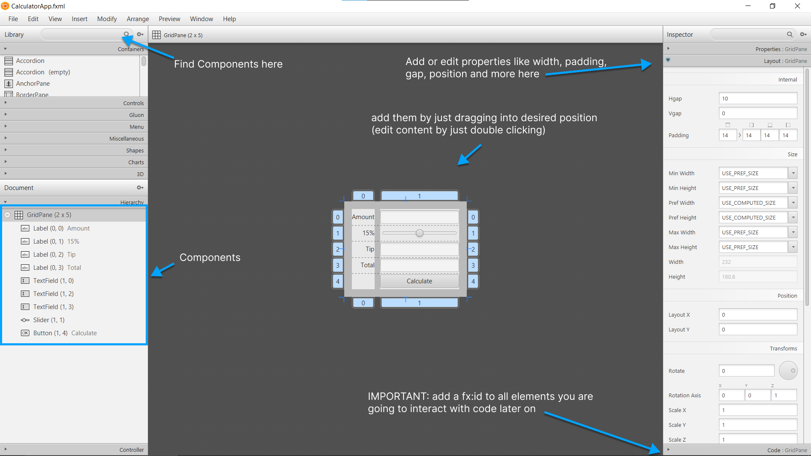

# Tip Calculator Java GUI Creation Process

## Download SceneBuilder
this is used as a very simple way for creating the GUI layout and is basically like an editor that gives you the "HTML" at the end.

https://www.oracle.com/java/technologies/javafxscenebuilder-1x-archive-downloads.html


## Create new CalculatorApp.fxml file

this is done inside the SceneBuilder.

Make your GUI design in this step by using the editor.



After you are happy with your design, copy the generated Controller.java starting code. It should be similar to this one:
```
import javafx.event.ActionEvent;
import javafx.fxml.FXML;
import javafx.scene.control.Button;
import javafx.scene.control.Label;
import javafx.scene.control.Slider;
import javafx.scene.control.TextField;

public class CalculatorAppController {

    @FXML
    private TextField amountTextField;

    @FXML
    private Button calculateButton;

    @FXML
    private Label tipPercentageLabel;

    @FXML
    private Slider tipPercentageSlider;

    @FXML
    private TextField tipTextField;

    @FXML
    private TextField totalTextField;

    @FXML
    void CalculateButtonPressed(ActionEvent event) {

    }

}
```
The CalculatorApp.jxml is directly edited by the SceneBuilder (you don't need to export or anything like that).

To preview your current progress, simply Ctrl + P

